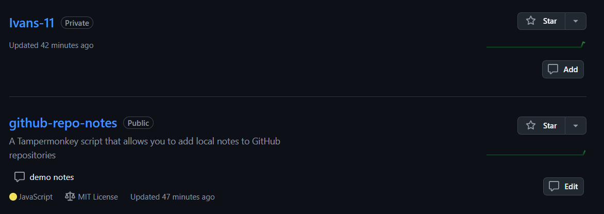

[中文](README.zh.md) | English

Ever starred a GitHub repo and forgot why?

This script lets you add private notes to any repository — whether you starred it or not and whoever it belongs to.

# GitHub Repo Notes

A Tampermonkey script that allows you to add local notes to GitHub repositories

## Features

- Add and modify notes for repositories in GitHub repository list or detail pages
- Notes are saved in local storage and invisible to other users

## Installation

1. First, install the [Tampermonkey](https://www.tampermonkey.net/) browser extension
2. Click the following link to install the script:
   [GitHub Repo Notes](https://update.greasyfork.org/scripts/535967/GitHub%20Repo%20Notes.user.js)

## Usage

1. On GitHub repository list page:

   

   - A note button appears on each repository card
   - Click the button to add or edit notes
   - Notes are displayed on the repository card

2. On repository detail page:

   

   - A note button appears in the top action bar
   - Click the button to add or edit notes
   - Notes are displayed below the repository description

## Notes

- Note data is saved in browser's local storage
- Clearing browser data will result in data loss
- Notes are not synchronized between different browsers