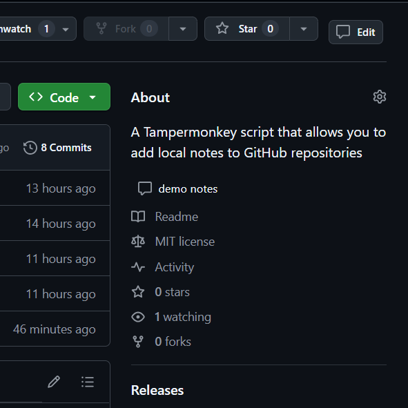

中文 | [English](README.md)

# GitHub Repo Notes

一个可以为GitHub仓库添加本地备注的油猴脚本

## 功能

- 在GitHub仓库列表或详情页中为仓库添加和修改备注，便于仓库的查找和管理
- 备注数据保存在本地存储中，对其他用户不可见

## 安装

1. 首先安装 [Tampermonkey](https://www.tampermonkey.net/) 浏览器扩展
2. 点击以下链接安装脚本：
   [GitHub Repo Notes](https://update.greasyfork.org/scripts/535967/GitHub%20Repo%20Notes.user.js)

## 使用

1. 在GitHub仓库列表页面：

   

   - 每个仓库卡片上会出现一个备注按钮
   - 点击按钮可以添加或编辑备注
   - 备注会显示在仓库卡片上

2. 在仓库详情页面：

   
   
   - 在页面顶部的操作栏中会出现备注按钮
   - 点击按钮可以添加或编辑备注
   - 备注会显示在仓库描述下方

## 注意

- 备注数据保存在浏览器的本地存储中
- 清除浏览器数据会导致数据丢失
- 不同浏览器之间的备注数据不互通